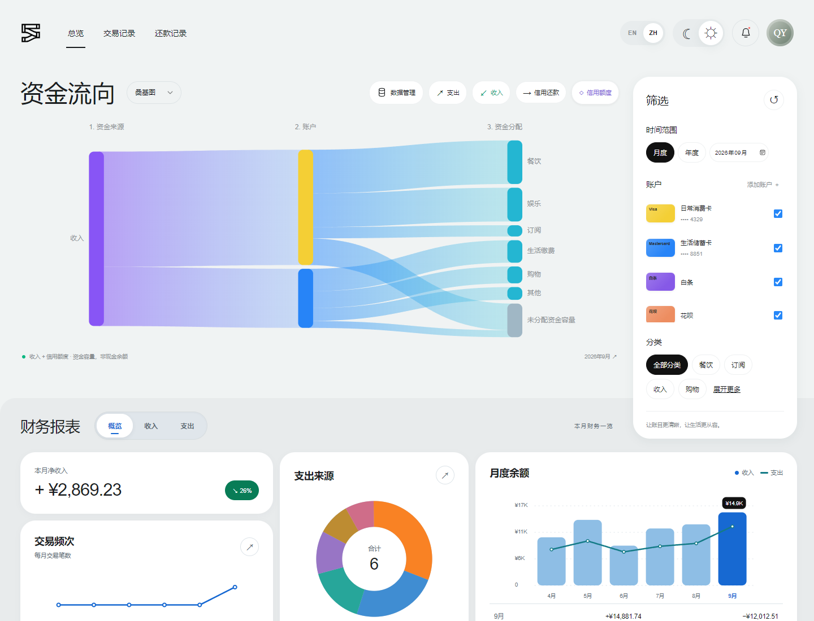
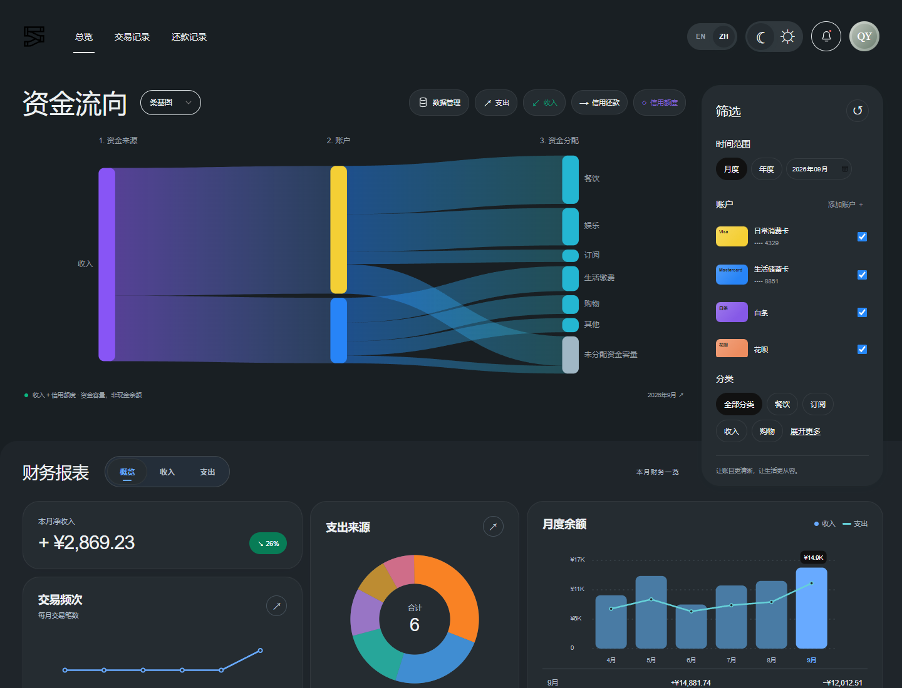
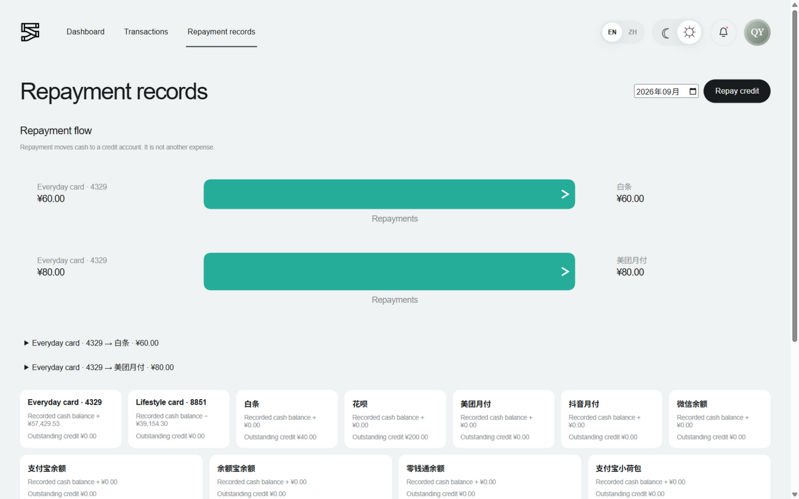
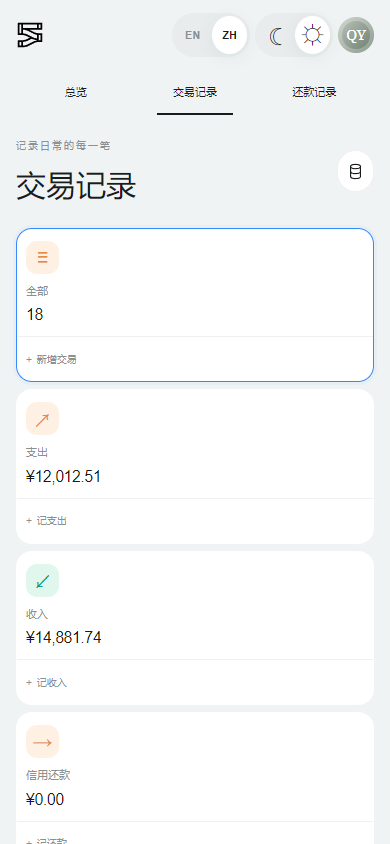

<div align="center">

# FluxLedger

### 看清资金流向，记好每一笔生活。

一个基于 Vue 3 的本地记账 Web 应用，集资金流可视化、收支统计与信用还款管理于一处。

**浏览器本地存储 · 无需后端 · 中英双语 · 日夜主题**

[在线体验](http://leakice.cn) · [界面预览](#界面预览) · [快速开始](#快速开始) · [数据与备份](#数据与备份)

</div>



## 让账目有迹可循

从一笔日常消费，到一笔信用还款，FluxLedger 把记录、分析和资金关系放在同一个界面里。打开即可浏览演示账本，也可以在本地运行，逐步建立自己的收支记录。

| 能力 | 你可以做什么 |
| --- | --- |
| 🌊 资金流可视化 | 用 SVG 桑基图查看资金来源、账户与分类之间的分配关系，悬停查看关联流向与提示。 |
| 📊 收支分析 | 按月或按年查看收入、支出与净收益，结合分类占比、交易频次和月度收支图理解账目。 |
| 🧾 交易管理 | 新增、编辑、搜索和筛选记录，查看完整历史，支持删除与撤销。 |
| 💳 账户与信用 | 管理账户名称、卡片尾号、卡组织与配色；按生效日期设置额度，跟踪信用消费和未还负债。 |
| ↗ 信用还款 | 将还款关联到具体消费，支持分次还款；查看付款账户到信用账户的实际还款流向。 |
| 📦 数据迁移 | 导出 JSON 账本备份，恢复 JSON 或导入兼容的 CSV 文件，在不同浏览器之间手动迁移。 |

## 界面预览

### 白天清爽，夜晚沉静

EN / ZH 与日夜模式随时切换，选择会保存在当前浏览器。图表使用项目内的 SVG 实现，应用运行时无需加载外部字体或图表 CDN。



### 每笔还款，都有来处与去向

还款页展示「付款账户 → 信用账户」的流线，并提供关联消费与还款明细。账户余额和未还负债按所选期间截止日计算。



### 小屏幕，也能完整记账

窄屏采用可折叠筛选、交易卡片与单列表单。资金图保留可读尺寸，可在图内横向滚动；界面尊重系统的减少动态效果设置。

<p align="center">
  
</p>

<sub>总览与手机截图使用默认演示账本；还款截图使用包含信用消费与还款的演示场景。默认月份为 2026 年 9 月，金额统一使用人民币（¥）。</sub>

## 快速开始

需要 **Node.js 20.19+（20.x）或 22.12+**，以及 npm。准确版本范围以 [package.json](package.json) 的 `engines` 为准。

```bash
git clone https://github.com/Leakice/FluxLedger.git
cd FluxLedger
npm ci
npm run dev
```

打开 **[http://127.0.0.1:4173](http://127.0.0.1:4173)**。

项目无需配置环境变量、后端服务或数据库。开发与预览服务都固定使用 `4173` 端口；如果端口被占用，先停止占用该端口的服务。

第一次使用，可以按这个顺序熟悉账本：

1. 点击 **ZH** 切换中文，浏览默认的 2026 年 9 月演示数据。
2. 在账户面板中编辑账户，按实际情况录入收入、支出或信用额度。
3. 录入支出时选择信用卡或网贷账户，系统会自动识别为信用消费；随后通过「信用还款」关联还款。
4. 按时间、账户与分类筛选，查看资金分配及收支变化。
5. 在「数据管理」中导出 JSON 备份。

## 理解账本里的数字

**资金容量、现金余额和未还负债各有含义。** 阅读图表时，可以参考下面的规则：

| 记录或指标 | 计算方式 |
| --- | --- |
| 普通支出 | 计入消费支出，并减少对应账户的已记录现金余额。 |
| 信用消费 | 计入消费支出并产生未还负债，不扣减现金余额。 |
| 信用还款 | 减少付款账户现金及关联消费的未还负债，不重复计入消费支出，也不计入收入。 |
| 信用额度 | 截止所选期间结束日，取最新生效的一条设置；历史额度不累加，可设为零。额度不计入收入、净收益或收支频次。 |
| 桑基容量图 | 资金来源包含当期收入与生效额度，表达资金容量，不能直接当作现金余额。 |
| 已记录现金余额 | 从截止日之前已录入的收入、现金支出与还款推导，未录入的期初余额不包含在内。 |

例如：信用消费 **¥100** 后，消费统计增加 ¥100、未还负债增加 ¥100。之后从另一账户还款 **¥40**，付款账户现金减少 ¥40、剩余负债变为 ¥60，消费统计仍为 ¥100。

还款支持多次部分偿还，全额偿还后显示已还清。系统会拒绝超额、负数、自账户以及早于消费日期的还款；删除有关联还款的消费前，需要先移除对应还款。

## 数据与备份

账本保存在**当前站点、当前浏览器的 `localStorage`** 中，没有服务端账本存储，也不会自动跨设备同步。语言与主题偏好同样保存在本地。

- **导出：**「数据管理 → 导出数据」，下载包含交易与账户等账本数据的 JSON 备份。
- **恢复：**「数据管理 → 导入数据」，选择 JSON，核对预览中的交易与账户数量，再确认导入。
- **CSV：**支持兼容格式的交易导入；字段与账户引用需要通过校验，不是任意银行 CSV 都能直接使用。完整迁移优先使用 JSON。

> **导入会替换当前本地账本，不会与已有记录合并。** 清理网站数据也会删除账本；导入、清理数据或切换访问域名前，请先导出备份。线上站点与本地地址拥有各自独立的数据。

## 开发与部署

| 命令 | 用途 |
| --- | --- |
| `npm ci` | 根据锁文件安装依赖。 |
| `npm run dev` | 启动本地开发服务；`npm start` 为同等入口。 |
| `npm test` | 运行账本逻辑、数据交换、表单、账户、交易列表与图表相关测试。 |
| `npm run build` | 构建生产文件，输出到 `dist/`。 |
| `npm run preview` | 在 `127.0.0.1:4173` 预览生产构建。 |

```bash
npm test
npm run build
npm run preview
```

将生成的 `dist/` 发布到静态托管服务即可。`preview` 用于本地检查构建结果；生产环境使用静态服务器。现有的 [develop 环境部署文档](docs/develop-deployment.md) 提供了 Nginx 配置、发布验证与回滚流程。

### 技术栈与结构

**Vue 3** 管理响应式界面，**Vite 8** 提供开发与构建，**原生 SVG + CSS** 绘制图表与主题，**Node.js 内置测试运行器**验证核心逻辑。

```text
FluxLedger/
├── src/
│   ├── App.vue                 # 页面、响应式状态与交互编排
│   ├── ledger.js               # 账户、额度、信用消费、还款与余额校验
│   ├── charts.js               # 资金容量图与还款流图
│   ├── flowInteraction.js      # 资金图高亮与提示交互
│   ├── transactionView.js      # 交易筛选与排序
│   ├── dataTransfer.js         # JSON 备份恢复与 CSV 导入
│   ├── components/             # 图表、记账、账户及数据管理组件
│   ├── locales.js              # 中英文词典
│   ├── seed.js                 # 演示账目
│   ├── responsive.css          # 窄屏布局
│   ├── reports.css             # 报表样式
│   └── *.test.js               # 自动化测试
├── public/assets/              # 本地静态资源
├── docs/                       # 部署说明与 README 截图
├── style.css                   # 全局主题与动画
└── vite.config.js              # 开发与预览配置
```

## 常见问题

<details>
<summary><strong>为什么打开后就有账目？</strong></summary>

首次加载会使用演示数据，默认展示 2026 年 9 月。演示记录并非个人账户的真实流水，也不会连接银行自动同步。建立自己的账本时，需要自行处理演示记录或导入自己的兼容数据。

</details>

<details>
<summary><strong>为什么换一个浏览器后看不到之前的记录？</strong></summary>

本地数据按浏览器和站点隔离。请在原浏览器导出 JSON，再在目标浏览器导入；域名、协议或端口变化也会对应不同的本地存储空间。

</details>

<details>
<summary><strong>在线地址无法打开怎么办？</strong></summary>

在线入口为 [leakice.cn](http://leakice.cn)。原项目说明提示该站点在部分网络环境下可能需要代理；如果使用代理，可检查该域名是否被 `.cn` 直连规则优先匹配，并为域名配置合适的规则。也可以按上面的快速开始步骤在本地运行。

</details>

---

发现问题或有改进建议，欢迎提交 [Issue](https://github.com/Leakice/FluxLedger/issues)，附上复现步骤、浏览器版本和使用的主题。提交截图或样例账本前，请移除个人财务信息。
