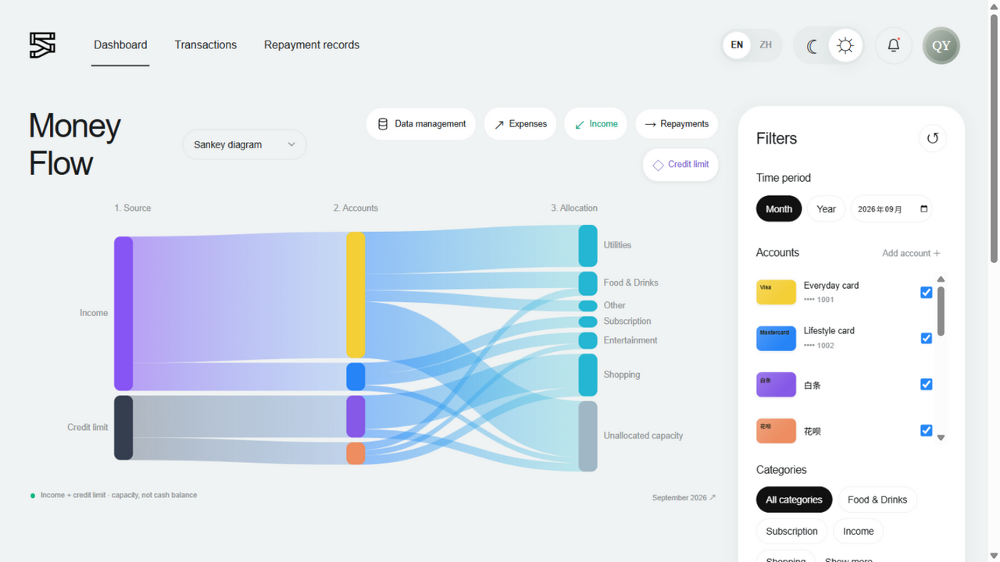
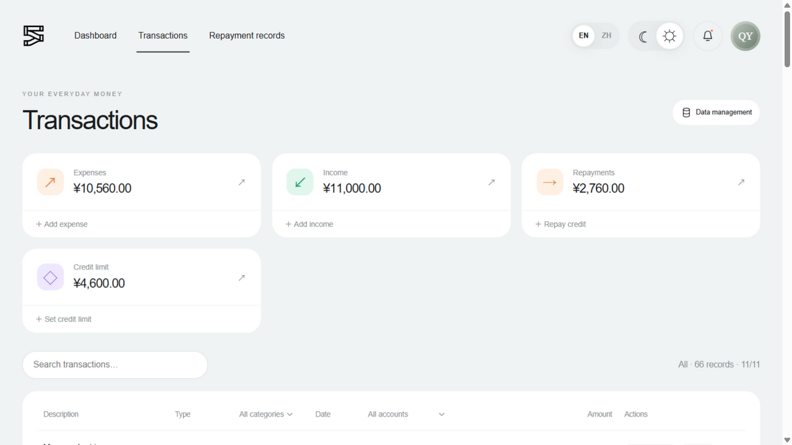
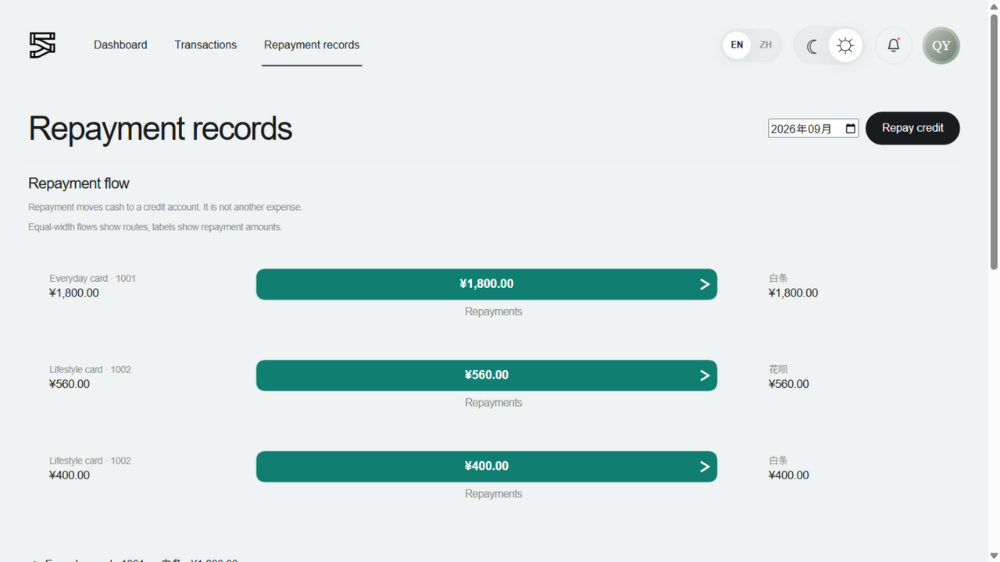

# Sites 运行时接入结论（T3.0 spike）

日期：2026-09-13
分支：feat/cloud-pr3-cloud-ledger
对应任务：#57–#61 的先行 spike（T3.0），目标：主应用（Vue SPA）与 Sites 运行时（vinext + sites 插件 + Cloudflare Worker）共存。

## 结论

**可行。** Vue SPA 以「客户端 bundle」形态运行在 vinext 应用路由之下：`app/page.tsx` 作为壳渲染 `#app` 容器，客户端动态加载现有 Vue 入口（`src/main.js`），`/api/*` 为同源服务端路由。构建、开发、生产预览三条链路全部验证通过，未发现 vinext 对非 React 页面的硬约束。**不需要维护者额外决策，PR3 按此形态实施。**

## 验证证据

| 验证项 | 结果 | 证据 |
| --- | --- | --- |
| `vinext build`（vue 插件共存） | ✅ | 5 个环境（client/ssr/rsc/server analyze/…）全部构建成功；Vue bundle（含 `createApp` 与 App.vue 模板）进入 `dist/client/_next/static/chunks/vue-shell-*.js`；样式输出到 `static/css/main.*.css` |
| 生产形态（`npm run start`，wrangler dev 跑 `dist/server/wrangler.json`） | ✅ | `GET /` 返回 200，SSR 壳 HTML 含 `#app` 与 vue-shell chunk 的 `modulepreload`；三页截图见下 |
| Vue 应用完整挂载渲染 | ✅ | 桑基图/筛选器/报表/还款流全部与现状一致（浏览器 DOM 快照 + 截图） |
| 游客身份语义 | ✅ | `GET /api/whoami` 未登录返回 401 JSON + `Cache-Control: no-store`（复用 sites-verify 的已验证实现） |
| 本地 mock 登录（sites 插件 dev 中间件） | ✅ | `/signin-with-chatgpt?return_to=/` 302 置 cookie 后 `whoami` 返回 200（`local_seedy`），`/signout-with-chatgpt` 可退出 |
| 游客模式行为 | ✅ | 构建产物上浏览器实测：localStorage 仅 `cascade-language`/`cascade-theme` 立即写入，交易键仍只在保存时写入——与主干行为一致 |

截图（构建产物、127.0.0.1:8787，游客模式）：

## 形态与关键决策

1. **挂载方式**：`app/page.tsx`（静态壳）→ `app/vue-shell.tsx`（`"use client"`）在 `useEffect` 中动态 `import("../src/main.js")`；`src/main.js` 保持模块加载即 `createApp(App).mount('#app')` 的现有行为不变。React 只拥有空的 `#app` 容器，Vue 挂载后不再与之冲突。
2. **样式**：继续由 `src/main.js` 的 JS import 引入（style.css / responsive.css / reports.css），与原 SPA 相同，壳层零重复。
3. **同源约束**：前端只调用同源 `/api/*`（whoami、ledger），认证头由平台在同源请求上注入；无跨域调用。
4. **身份获取**：`app/chatgpt-auth.ts` 与 `app/api/whoami/route.ts` 从 sites-verify 原样复用（PR1 已在托管环境验证其 401/200 语义）；前端登录态通过 `/api/whoami` 获取。
5. **`next` 包不引入**：vinext 内置 `next/headers`、`next/navigation` 等 shim（`vinext/dist/shims/`），chatgpt-auth 的运行时 import 由 shim 解析；类型 import 编译期擦除。仅新增 react/react-dom（vinext peer 要求）。

## 依赖增量（均为 sites 运行时必要项）

- devDependencies：`vinext@1.0.0-beta.5`、`@vitejs/plugin-rsc@0.5.26`、`@vitejs/plugin-react@6.0.2`、`react-server-dom-webpack@19.2.6`、`@cloudflare/vite-plugin@1.54.8`、`@cloudflare/workers-types`、`typescript`、`@types/react(-dom)`、`drizzle-kit`（仅本地生成迁移用）
- dependencies：`react@19.2.6`、`react-dom@19.2.6`（壳层运行时）
- `@cloudflare/vite-plugin` 取 1.54.8 而非 sites-verify 的 1.37.1：1.37.1 内嵌 wrangler 4.92 与仓库现有 wrangler ^4.131.1 的 peer 冲突；1.54.8 正好配套 wrangler 4.131.1
- **不引入** `next` 包、UI 组件库、drizzle-orm（API 直接用 D1 原生 prepare）

## 踩坑记录（重要）

1. **根目录 `wrangler.toml`（PR1 Pages 历史配置）会被 `@cloudflare/vite-plugin` 自动发现**：
   - `cloudflare({ config: <内联对象> })`：内联配置与发现的 wrangler.toml 合并，产物出现两个同名 `DB` D1 绑定，wrangler dev 报 "DB assigned to multiple D1 Database bindings"；
   - 插件正确选项是 `configPath`（文件路径，独占生效）；内联 `config` 期望的是 customizer 函数。
   - 解决：新增 **`wrangler.worker.jsonc`**（Sites Worker 专用，本地占位 database_id），`vite.config.js` 显式 `configPath` 指向它；根 `wrangler.toml` 原样保留（约束：不动 PR1 产出）。
2. **dev 与生产形态差异**：`vinext dev` 下对 `/` 的文档请求会回落到 vite 的 `index.html`（纯 Vue SPA + HMR），app router 壳在生产构建才接管；`/api/*` 两种形态下都走 app router。开发体验与旧 SPA 一致，托管形态以构建产物为准。
3. `.dev.vars` 会被 cloudflare 插件读入本地 dev（构建日志出现 "Using secrets defined in .dev.vars"）——本地 secret 不进仓库，远端由平台注入。
4. vinext 构建时会提示部分路由"could not be classified"（静态分析局限），不影响功能；`/api/whoami` 实测行为正确。

## 脚本变化

- `npm run dev` → `vinext dev`（127.0.0.1:5173，mock 登录：访问 `/signin-with-chatgpt?return_to=/`）
- `npm run build` → `vinext build`（产物 `dist/client` + `dist/server` + `dist/.openai`）
- `npm run start` → wrangler dev 预览构建产物（127.0.0.1:8787）
- `npm test` 不变（node --test，与 vite/vinext 无关）
- 原 `npm run preview`（vite preview）随 SPA 直出形态移除，由 `start` 取代

## 边界说明

- 本 spike 只证明「能跑、能构建、能登录」；托管环境的双账号隔离、重部署持久化等由 T3.5 的托管验证清单覆盖（浏览器操作由维护者执行）。
- 登录/登出路由（`/signin-with-chatgpt`、`/signout-with-chatgpt`、`/callback`）为平台保留路由，应用不实现也不拦截；SIWC 必须顶层导航发起（`target="_top"`），禁止 fetch/客户端路由预取。
